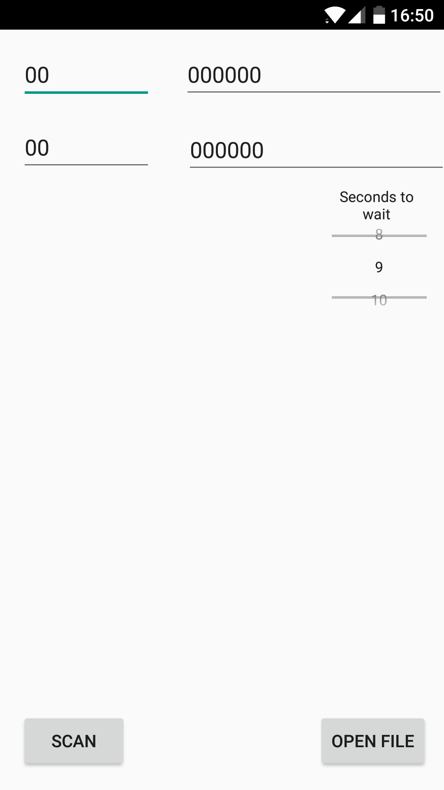
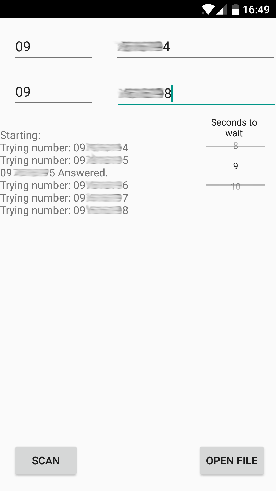

# android-wardialer
"A technique to automatically scan a list of telephone numbers..." [Wiki](https://wikipedia.org/wiki/War_dialing).

An implemantion of Wardialing technique as described in [Wikipedia](https://wikipedia.org/wiki/War_dialing), written in native Android.

Thanks to [Digitalwhisper](https://www.digitalwhisper.co.il) magazine for the quality information and for reminding me the name of this technique.

[Playstore](https://play.google.com/store/apps/details?id=com.bergereden.wardialerfree) - Free
[Playstore](https://play.google.com/store/apps/details?id=com.tiger.wardialer) - $1

Screenshots:

